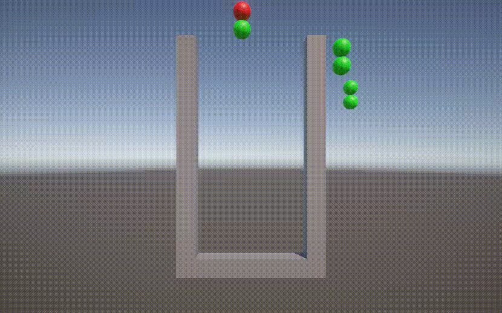
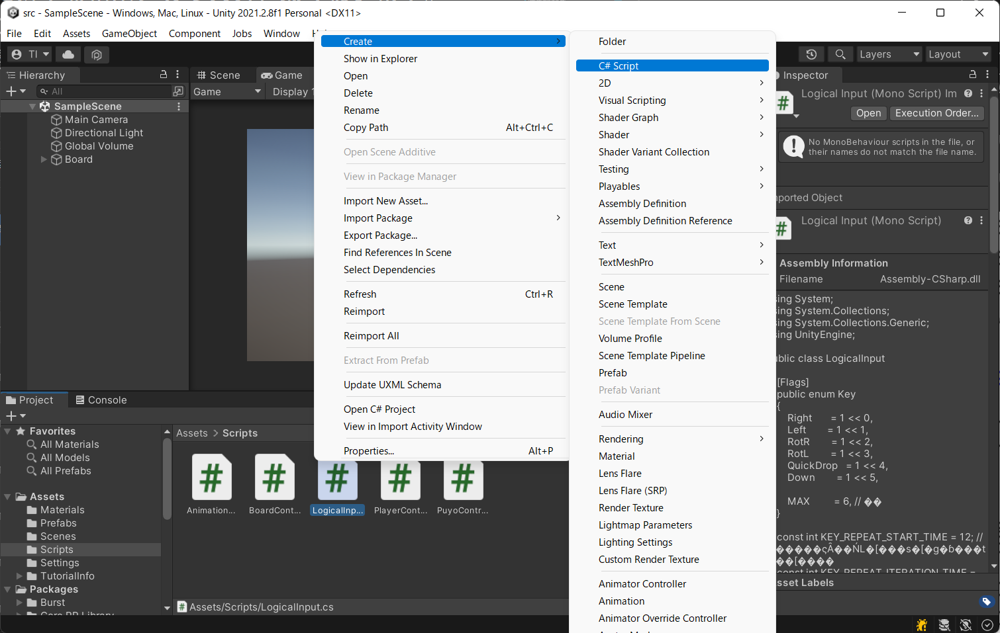
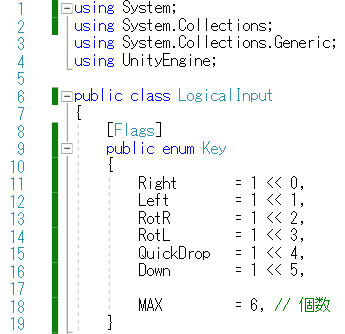
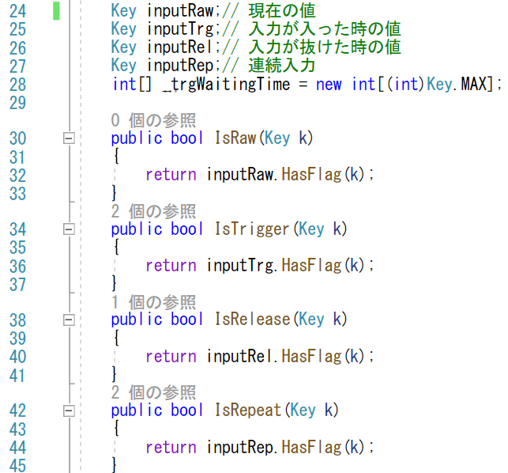
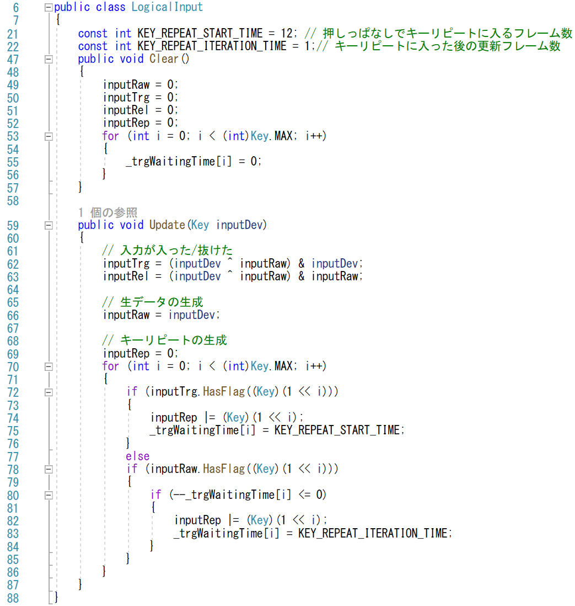
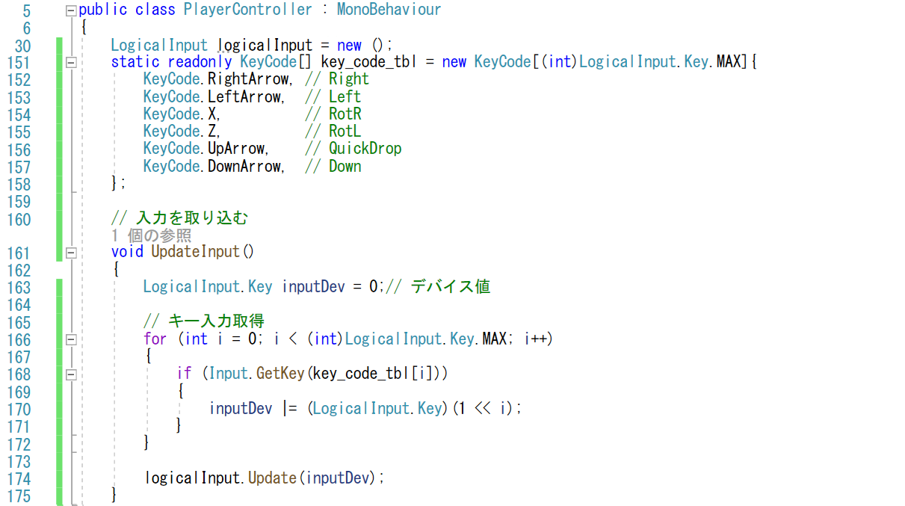
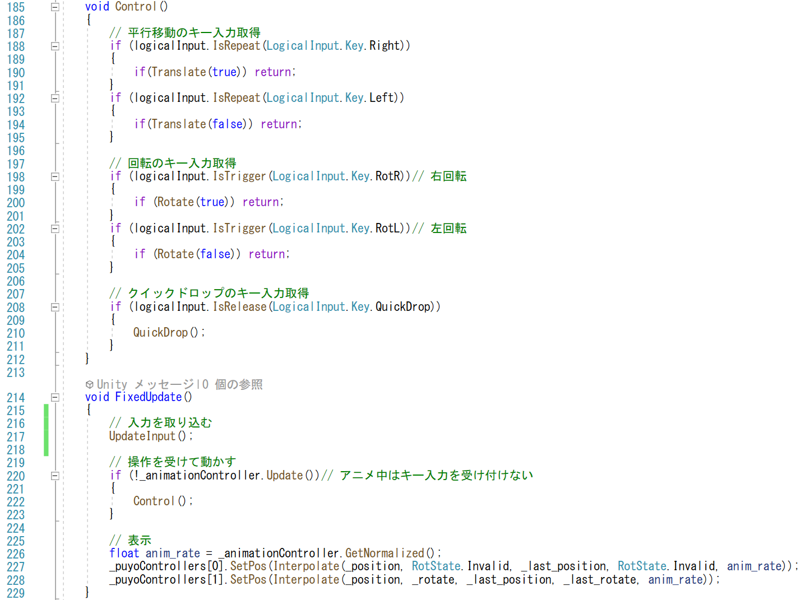
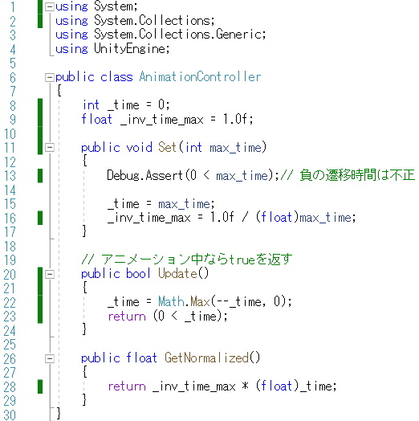
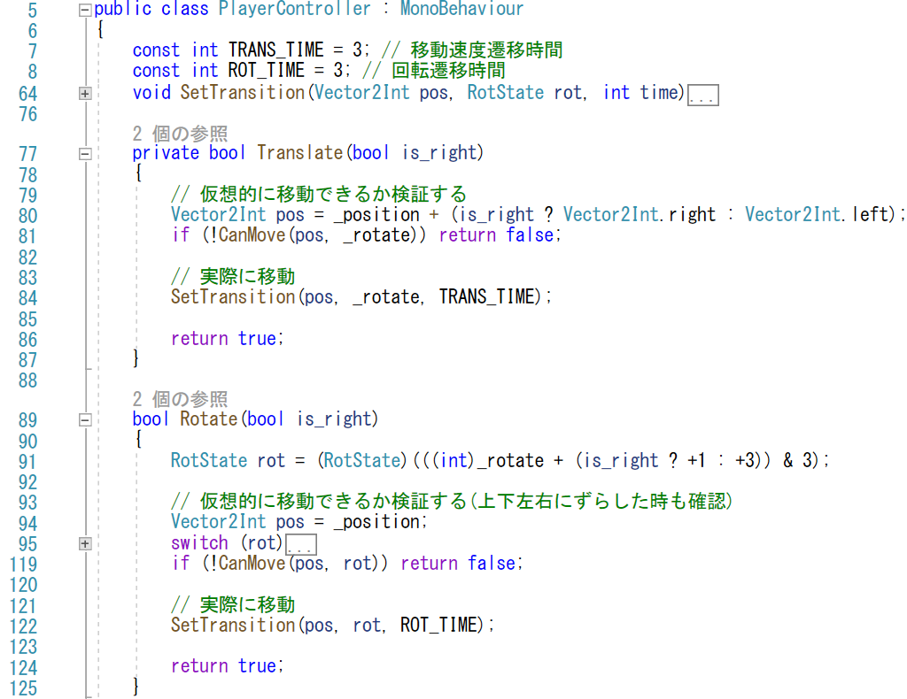

# 概要
ここまでは、可変フレームレートでの処理でした。
AAAのFPSのような重たい処理なら可変フレームレートが良いですが、
軽量なパズルでは処理落ちすることもあまりありませんし、
処理落ちをして勝ち負けが変わるようだと、不満を持つ人が出てきます。
例えば、キーリピートがあります。フレームレートの違いでキーが入力されるタイミングがずれるのは、勝敗に影響するので避けた方が良いでしょう。
という事で、ゲームのロジック的な処理を
固定フレームレートにしてみます。
具体的には、ゲームオブジェクトのスクリプトをUpdateで更新するのではなくて、FixedUpdateで処理します。

# 手順
今回の、固定フレームレート処理で行う変更はアニメーションを整数化することと、キーリピートの実装です。次のステップで実装していきたいと思います。
1. キーリピート
2. プレイヤーの処理の固定フレーム化
3. アニメーションの整数化

## キーリピート

キーリピートの実装としてはキーリピートだけではなく、オン・オフ・押しっぱなしの管理もしたいものです。
そのため「論理入力デバイス」を導入したいと思います。
「論理入力デバイス」は、本ゲーム専用の入力で、「X」や「↑」といったキーで入力を考えるのではなく「右回転」、「ドロップダウン」などのゲームロジックに対する指示として入力を取り扱います。
ゲームエンジン自体もこのような別名をつけて入力を扱う仕組みはあるのですが、細かな調整ができるようにするため、独自に実装してみましょう。

### 「LogicalInput」の導入
- C#Script の生成で、「Scripts」フォルダに「LogicalInput」を作成
- 「LogicalInput」を開いて、クラス宣言の後の「 : MonoBehaviour」を削除
  - キーリピートの処理は軽量なので、シンプルなクラスとして扱ってみます。

「LogicalInput」の処理では、まずボタンの種類を定義します。
ボタンの取り扱いは、１ビットで管理するとまとめて処理できるので、フラグとして扱います
- flags が使えるように「using System」を追加 (1行目)
- 「[flags]」をつけて、enum を宣言 (8-19行目)
  - 将来的に下に素早く移動できるように「下ボタン」も定義
  - テストするコードが書きやすくなるように、最大値「MAX」も定義

メンバー変数としては、入力の値を保持する変数を用意します。用意する変数は次の通りです

- inputDev: ハードウェア的なON/OFFを保持する
- inputRaw: ゲームロジック的なON/OFFを保持する
- inputTrg: 各ボタンが押された瞬間だけON
- inputRel: 各ボタンが離された瞬間だけON
- inputRep: キーリピート的なON/OFFを保持する

また、キーリピート情報を生成するために、残り無効時間を保持するための整数をボタンごとに保持します (29行目) 。

なお、外部からこれらの変数にアクセスするには、public公開された「Is***」メソッドを通して、各フラグが立っているかどうかを確認します。(31-46 行目)

値を取得する以外のメンバーメソッドには、状態の設定があります。
- Clear: 初期化 (47-57行目)
  - 関係する全ての値を0クリアする
- Update: デバイスからの入力を受けての内部状態の更新
  - 押された瞬間、離された瞬間の検出 (62,63行目)
    - xor 演算で前のボタンの状態と現在のボタンの状態を比較して異なる値になっているボタンを検出した後、ボタンの「現在」の状態でorを取って、「押した瞬間」を判定する
    - xor 演算で前のボタンの状態と現在のボタンの状態を比較して異なる値になっているボタンを検出した後、ボタンの「前」の状態でorを取って、「離した瞬間」を判定する
  - 現在のデバイスの状態を更新 (66行目)
    - 押された瞬間の導出に必要なので、押された瞬間を計算した後で上書きする
  - キーリピートの生成 (69-86行目)
    - 押された瞬間はON (74行目)
    - 押された瞬間の後は押しっぱなしでもONにならない時間を設定 (75行目)
    - 押された瞬間でなくて押しっぱなしなら、ボタンに応じたカウンタを減らす (80行目)
    - カウンタが0になったら、リピートをONにする (82行目)
    - 2度目以降はONになるまでの時間は短くする(83)
      - 今回は、左右移動の為のキーリピート時間なので２度目以降は１フレでONにしていますが、メニューでのカーソル移動等はもっと長い時間の方が自然な動きになるかもしれません

### 「LogicalInput」の利用

「LogicalInput」を使うには、「PlayerController」のコードも修正します。
- 「LogicalInput」メンバーの追加 (30行目)
- 「LogicalInput」に現在のデバイスの値を与えて更新 (174行目)
  - 現在のデバイスの値は、該当するボタンのキーをテーブルとして用意しておいて (151-158行目)、Updateを呼び出す前にそれぞれのキーが押されているかどうかを調べていきます。(166-172行目)
    - キーコンフィグを導入する場合や、対戦プレイにする場合には、このテーブルを readonly にしないで、書き換えて行きます。

## プレイヤーの処理の固定フレーム化

「PlayerController」に用意した「UpdateInput」メソッドは、「PlayerController」の更新処理で呼び出します。
今回、固定フレームレートにするので、「Update」ではなく「FixedUpdate」メソッドを用意します。 (214-229行目)

「UpdateInput」メソッドで入力処理をした後、「Control」メソッドで入力に応じた処理を行います。

「Control」メソッドの中では、今までの判定に「GetKeyDown」等を用いていたものを、論理入力に置き換えていきます
- 左右移動はキーリピートで判定 (188, 192行目)
- 回転は押した瞬間で判定 (198, 202行目)
- クイックドロップは話した瞬間で判定 (208行目)
  - 押した瞬間に判定すると「あ、落とす場所がずれていた」という事が起きやすいので、押した後も補正できるように話した瞬間を使用

## アニメーションの整数化

平行移動や回転をした際のアニメーションも整数化します。
今までの処理は、更新時間の分だけ残り秒数を浮動小数点数で
引いていたのですが、固定フレームレートではカウンタを
1ずつ減らすというシンプルな処理になります。

### 「AnimationController」の変更

アニメーションコントローラーでは、細かくいくつかの変更が入ります。全体としてはシンプルな処理になります。
- 残り時間のメンバー「_time」を整数化 (8行目)
  - 浮動小数点数として処理する場所ではキャストを追加 (16, 28行目)
- 遷移時間を設定する「Set」メソッドの引数を整数に (11行目)
- 「Update」メソッドの引数はなくす (20行目)
  - 内部では、「_time」を一つずつ減らして0未満にならないようにMaxメソッドでクランプする (22行目)
    - 一つずつ減らすので、減らす値の上限の確認は削除
    - Maxメソッドを追加するために「using System;」を追加 (1行目)

### 「PlayerController」の変更

アニメーションコントローラーを呼び出す「PlayerController」も
いくつかの修正が必要になります。
- 遷移時間の定数を整数化 (6, 7行目)
- 「SetTransition」の引数を整数化 (64行目)
  - 中の処理は変更なし
- 「SetTransition」の呼び出しの引数を整数化 (86, 124行目)
  - 定数の名前で設定するので、実質やることなし

# 検証

中身は色々と書き換えましたが、見える範囲での変更はほとんどありません。
左右への平行移動がキーリピートでできることを確かめましょう（逆に回転でキーリピートが効いていないことも確かめましょう）。